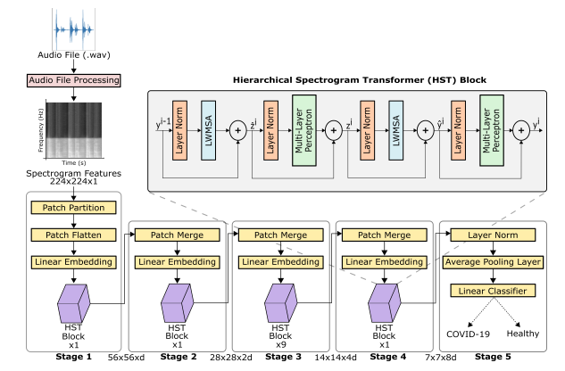

# **HST: Hierarchical Spectrogram Transformers**
This repository contains the official implementation of the Hierarchical Spectrogram Transformers (HST) described in the [following paper](https://arxiv.org/abs/2207.09529):

Aytekin, I., Dalmaz, O., Gonc, K., Ankishan, H., Saritas, E.U., Bagci, U., Celik, H., & Çukur, T. (2022). COVID-19 Detection from Respiratory Sounds with Hierarchical Spectrogram Transformers. ArXiv, abs/2207.09529.

<p align="center" width="100%">
    
</p>

## Dependencies
```
python>=3.6.9
torch>=1.7.0
torchvision>=0.8.1
librosa
cuda=>11.3
```

## Download pre-trained HST models
The following links contain pre-trained HST model weights on ImageNet:
- [HST-Small](https://drive.google.com/file/d/1MHSIBpM3-pa2xXKSrk5oEDTvlhIaC_M3/view?usp=sharing)
- [HST-Base](https://drive.google.com/file/d/1jol7869ixS77FyoAXzb_m3oJGTtKuOVO/view?usp=sharing)
- [HST-Large](https://drive.google.com/file/d/1kEQeLNnOH2yWTFp02TzFQqB1UiqtGmts/view?usp=sharing)

After downloading the weights, please align them as ```HST/model/imagenet_weights/hst_base_imagenet.pth```

## Dataset
The dataset in the paper [Exploring Automatic Diagnosis of COVID-19 from Crowdsourced Respiratory Sound Data](https://arxiv.org/abs/2006.05919) is used in this work. Their dataset is not publicly available but can be released for research purposes as said [here](https://github.com/cam-mobsys/covid19-sounds-kdd20).

For Task 1,
* covid: covidandroidnocough + covidandroidwithcough + covidwebnocough + covidwebwithcough  
* healthy: healthyandroidnosymp + healthywebnosymp

For Task 2,
* covid: covidandroidwithcough  + covidwebwithcough  
* healthy: healthyandroidwithcough  + healthywebwithcough

The audio files in the folders mentioned above are converted to spectrograms by ```wave2spectrogram.py```. Then, the dataset should be aligned as:
```
/data/
  ├── task1_cough
  ├── task1_breath
  ├── task2_cough
  ├── task2_breath  
 
/data/task1_cough/
  ├── train_test
  ├── val  
  
/data/task1_cough/train_test
  ├── covid
  ├── healthy
```

# Train and test
To train and test the chosen model with the determined seed, follow:
```
cd HST
python3 train.py --dataset "/data/task1_cough/train_test"  --model "hst_base"  --pretrained True  --seed 1
```
In our paper, HST is trained with 10 different seed for 10-fold like cross-validation. The results are averaged and reported in the paper.

# Demo
An audio file of a respiratory sound can be tested with ```demo.py```. The HST-Base model trained with task 2 cough modality data with seed 1 can be downloaded from [this link](https://drive.google.com/file/d/1O24zS1q2dFuPUTwtKjE7KeD2aWeLX9Q0/view?usp=sharing).
```
python3 demo.py --audio_path "sample_resp_sound"
```
Result is printed as "healthy" or "covid".

# Acknowledgements
This code uses libraries from [covid19-sounds-kdd20](https://github.com/cam-mobsys/covid19-sounds-kdd20).

For questions and comments, please contact me: aytekinayceidil@gmail.com
